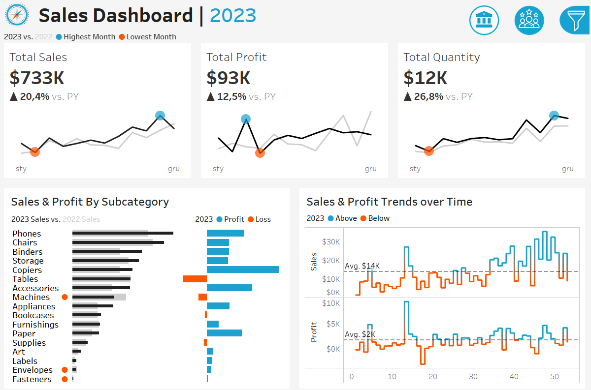
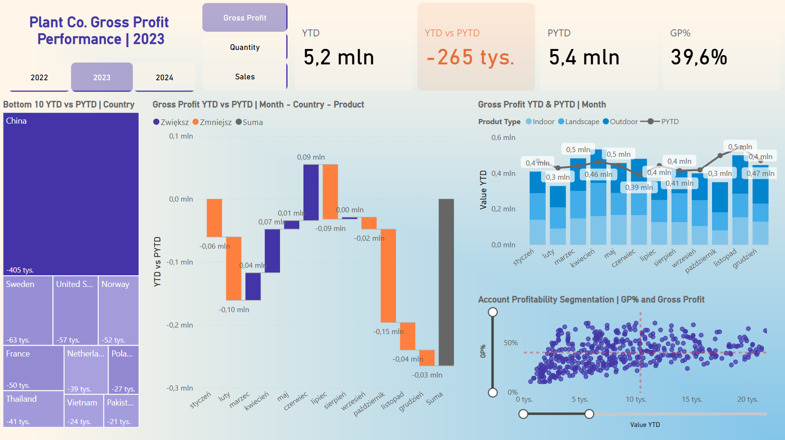
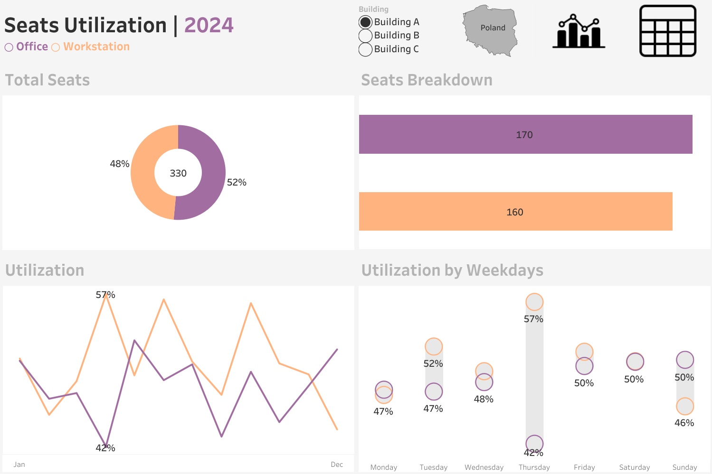
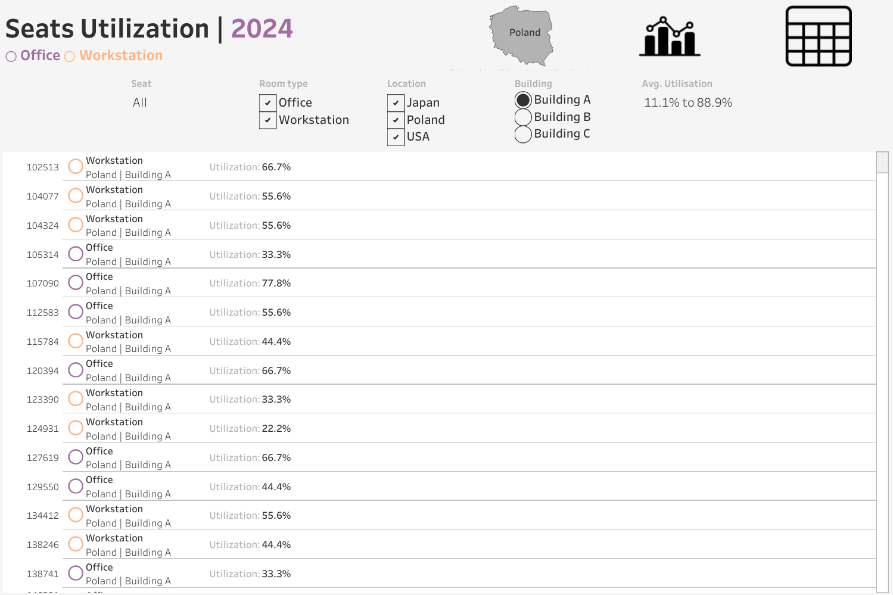

# 🚀 Projects

## 1. Sales and Customer Dashboard [Tableau]  
🔗 [View Project](https://public.tableau.com/views/SalesCustomersDashboards_17321298466710/SalesDashboard?:language=en-US&:sid=&:redirect=auth&:display_count=n&:origin=viz_share_link)  

✍️ This project features two interactive Tableau dashboards designed to analyze customer behavior and sales performance with year‑over‑year comparisons.

- **Sales Dashboard:** Monitors sales, profit, and quantity, breaks down results by product subcategories, and visualizes weekly sales and profit trends.
  
  

- **Customer Dashboard:** Tracks total customers and growth trends, segments buyers by order frequency, and highlights the top 10 most profitable clients.
  
  

🔎 Demonstrates skills in data preparation, interactive dashboard design, and visual storytelling to support business decision‑making.

---

## 2. Plant Co. Performance Dashboard [Power BI] 
🔗 [View Project](https://app.powerbi.com/view?r=eyJrIjoiZDc0ZTRhYzUtMzJiYy00OTRhLThiYzEtYjY3NTdmODI1MDg5IiwidCI6ImE2MjQ0ZjZhLWZlZTgtNDA2Yy1hYjJkLTE4YTJkZWNlYmIzMSJ9)  
 
✍️ An interactive Power BI dashboard analyzing Plant Co.’s performance over three years, with a focus on profitability trends across products, geographies, and time.

  

- **Performance Overview (YTD vs PYTD):** Tracks Gross Profit, Quantity, and Sales with variance analysis to highlight growth or decline.
- **Market Insights:** Identifies underperforming countries via treemaps and visualizes monthly KPI shifts with waterfall and line charts.
- **Segmentation:** Breaks down profitability by product type (Indoor, Outdoor, Landscape) and categorizes accounts by GP% for strategic decision‑making.

🔎 Delivers actionable insights for optimizing sales strategies, refining market focus, and improving product performance. Demonstrates skills in Power BI data modeling, DAX, and advanced visualization design.

---

## 3. Sales Performance Dashboard [Power BI] 
🔗 [View Project](https://app.powerbi.com/view?r=eyJrIjoiNTY2YzcyNzgtYzJiMy00OGNlLWI2MzAtNzRjZjkyZDZmYTE1IiwidCI6ImE2MjQ0ZjZhLWZlZTgtNDA2Yy1hYjJkLTE4YTJkZWNlYmIzMSJ9)  

✍️ An interactive Power BI dashboard providing a high‑level overview of global sales performance, market distribution, and order prioritization.

  

- **Key Metrics:** Tracks total sales, average sales, total orders, profit per order, shipped orders, and shipping costs.
- **Visual Insights:**
    - Line chart of monthly sales trends with min/max values.
    - Pie and doughnut charts breaking down markets and product categories (Technology, Furniture, Office Supplies).
    - Bar charts highlighting performance across business segments and ranking order priorities.

🔎 Demonstrates skills in Power BI, advanced DAX calculations, and dynamic visualization design. Supports decision‑making by identifying market opportunities, optimizing order strategies, and improving profitability.

---

## 4. Seats Utilization Dashboard [Tableau] 
🔗 [View Project](https://public.tableau.com/views/SeatUtilisationDemo/Overview?:language=en-US&publish=yes&:sid=&:redirect=auth&:display_count=n&:origin=viz_share_link)  
  
✍️ A Tableau dashboard designed to monitor workspace occupancy across multiple office locations in 2024, providing actionable insights for space optimization and resource planning.

- **Summary View:** Tracks total seat utilization, usage trends over time, and weekday comparisons to identify peak and low occupancy periods.
  
  
  
- **Detailed Analysis:** Offers seat‑level utilization tables with advanced filters by building, room type, and location, plus a utilization slider to spotlight under‑ or over‑used areas.
  
  
  
🔎 Helps facility managers and executives optimize office space allocation, reduce costs from under‑utilized areas, and make data‑driven decisions to improve workplace efficiency

---

# 📝 About Me

## 💼 Experience

### Banqsoft, Gdańsk  
**Business Analyst** (2025–Present)  
- Collaborate with Product Manager, Product Owner, and Business Analysts to deliver client-specific solutions.  
- Work closely with development teams to ensure successful implementation.  

### State Street, Gdańsk  
**Reporting Analyst** (2022–2025)  
- Automated Tableau Server reporting, reducing generation time from 1 week to 1 hour.  
- Designed a global portfolio reporting model in Power BI with automated ETL processes.  
- Built office space utilization dashboards in Tableau for senior management.  

**Business Analyst** (2019–2022)  
- Led EMEA-wide technology implementation projects, reducing manual errors by 70%.  
- Developed documentation and training, cutting onboarding time by 30%.  
- Enhanced Power BI dashboards based on stakeholder feedback, improving usability by 50%.  

**Fund Accountant, Gdańsk/Kraków** (2015–2019)  
- Streamlined accounting tasks with data-driven reporting, boosting efficiency by 20%.  
- Created KPIs for fund performance, reducing risk assessment time by 40%.  
- Maintained 99% accuracy in fund valuation audits.  

### Transcom Worldwide, Gdańsk  
**Verification Specialist** (2010–2015)  
- Led verification projects for Citi Handlowy credit card sales with 98% accuracy.  
- Designed case tracking systems, improving response time by 40%.  
- Built dashboards for KPI monitoring, increasing efficiency by 25%.  

---

## 🎓 Education

- **Master of Banking and Financial Advisory**, University of Gdańsk (2012–2014)  
- **Bachelor of Finance and Accounting**, University of Gdańsk (2009–2012)  

---

## 🛠️ Technical Skills

- **Data Visualization**: Tableau, Power BI  
- **Data Management**: SQL, ETL Process Design  
- **Productivity Tools**: Excel (Advanced), Microsoft Office  
- **Methodologies**: Agile PM  

---

## 🌐 Languages

- Polish (Native)  
- English (Advanced – C1)  

---

## 📜 Certifications

- SQL Programming (NASBA, 2024)  
- SQL Essential Training (NASBA, 2024)  
- Data Visualization for Data Analysis and Analytics (IIBA, 2024)  
- Tableau Essential Training (NASBA, 2024)  
- Change Management Foundation (APMG International, 2019)  
- AgilePM Foundation (APMG International, 2018)  
- Financial Controller (MEN, 2016)  
- Master of Excel (2015) 
