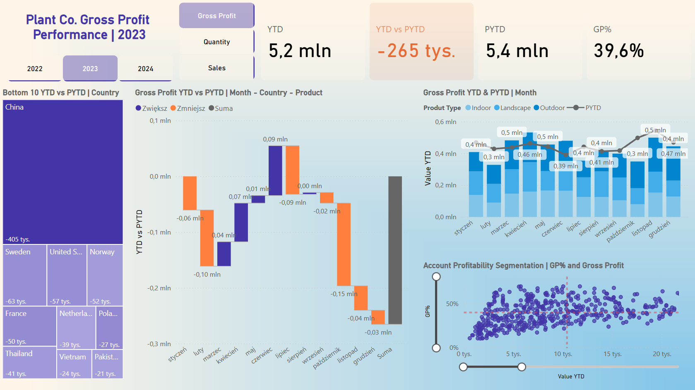
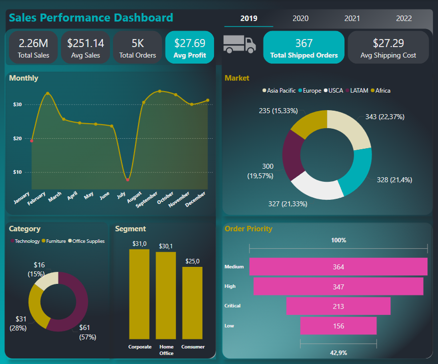
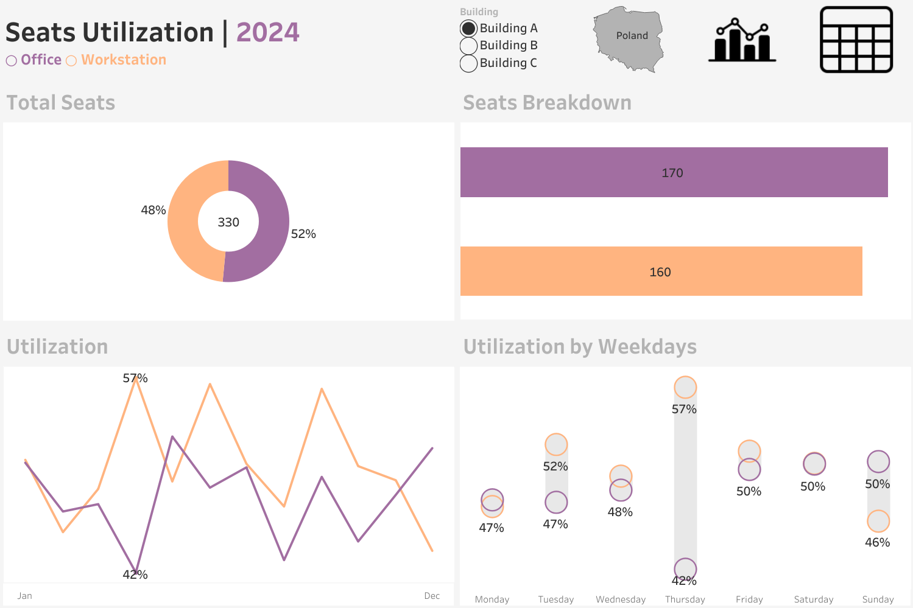
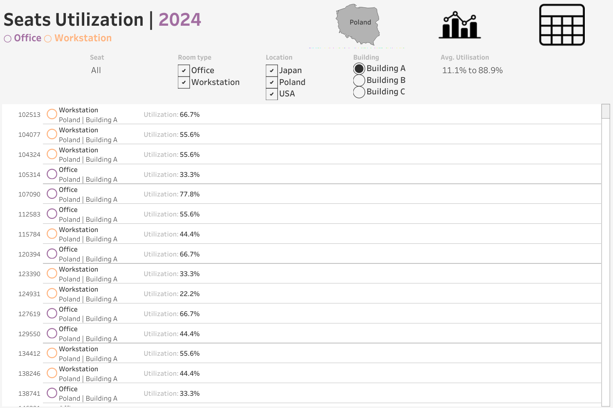
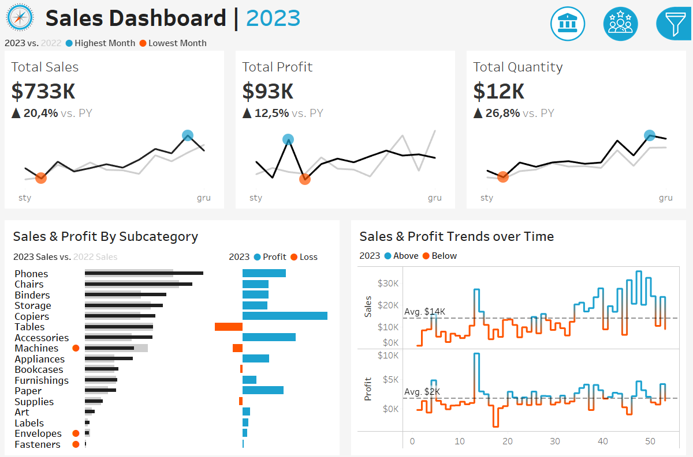
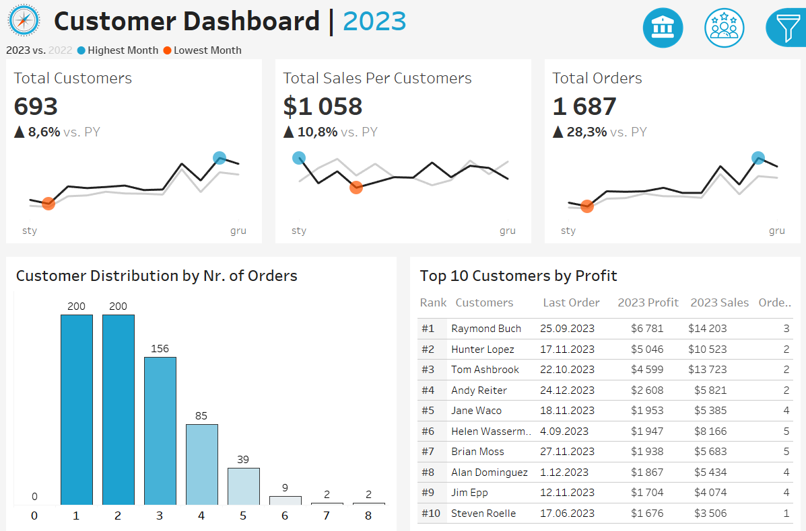
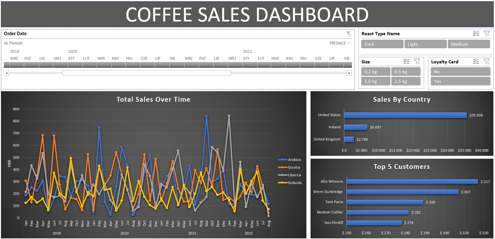

> *"For anyone looking for outstanding analysis, visualisations, and actionable insights, I highly recommend reaching out to him. His ability to transform complex data into clear, compelling visuals makes him a fantastic asset in any data-driven environment."*
>
> — **Anna Balandynowicz**, Head of Fund Admin Regulatory Change, SS&C Technologies

---

# 🚀 Projects

## 1. Savings Compass — Polish Bonds Savings Planner [React, JavaScript]
🔗 [Live demo](https://patrykkaminiecki.github.io/savings-compass/index.html)

✍️ A bilingual (PL/EN) interactive savings planner that ranks all Polish Treasury savings bonds (ROR, DOR, TOS, COI, EDO, ROS, ROD) plus a benchmark savings account against a user's goal, amount and horizon. Inspired by the work of **Marcin Iwuc**.

  

- **Personal flow:** 4-screen onboarding (name → goal → amount → horizon) with multi-goal comparison and inline editing.
- **Financial engine:** Month-by-month simulation including capitalization vs. payout, series rollover, early-redemption fees, Belka tax and a parallel savings-account benchmark.
- **What-if scenarios:** Live recalculation when the user adjusts inflation, NBP reference rate or savings-account rate.
- **UX:** Apple-inspired design system, dark/light mode, fully responsive single-file React app (no build step).

🔎 Demonstrates skills in product thinking, financial modeling, React and turning a personal-finance problem into a polished consumer tool.

---

## 2. Plant Co. Performance Dashboard [Power BI]
🔗 [View Project](https://app.powerbi.com/view?r=eyJrIjoiZDc0ZTRhYzUtMzJiYy00OTRhLThiYzEtYjY3NTdmODI1MDg5IiwidCI6ImE2MjQ0ZjZhLWZlZTgtNDA2Yy1hYjJkLTE4YTJkZWNlYmIzMSJ9)

✍️ An interactive Power BI dashboard analyzing Plant Co.'s performance over three years, with a focus on profitability trends across products, geographies, and time.

  

- **Performance Overview (YTD vs PYTD):** Tracks Gross Profit, Quantity, and Sales with variance analysis to highlight growth or decline.
- **Market Insights:** Identifies underperforming countries via treemaps and visualizes monthly KPI shifts with waterfall and line charts.
- **Segmentation:** Breaks down profitability by product type (Indoor, Outdoor, Landscape) and categorizes accounts by GP% for strategic decision‑making.

🔎 Delivers actionable insights for optimizing sales strategies, refining market focus, and improving product performance. Demonstrates skills in Power BI data modeling, DAX, and advanced visualization design.

---

## 3. Sales Performance Dashboard [Power BI]
🔗 [View Project](https://app.powerbi.com/view?r=eyJrIjoiNTY2YzcyNzgtYzJiMy00OGNlLWI2MzAtNzRjZjkyZDZmYTE1IiwidCI6ImE2MjQ0ZjZhLWZlZTgtNDA2Yy1hYjJkLTE4YTJkZWNlYmIzMSJ9)

✍️ An interactive Power BI dashboard providing a high‑level overview of global sales performance, market distribution, and order prioritization.

  

- **Key Metrics:** Tracks total sales, average sales, total orders, profit per order, shipped orders, and shipping costs.
- **Visual Insights:**
    - Line chart of monthly sales trends with min/max values.
    - Pie and doughnut charts breaking down markets and product categories (Technology, Furniture, Office Supplies).
    - Bar charts highlighting performance across business segments and ranking order priorities.

🔎 Demonstrates skills in Power BI, advanced DAX calculations, and dynamic visualization design. Supports decision‑making by identifying market opportunities, optimizing order strategies, and improving profitability.

---

## 4. Seats Utilization Dashboard [Tableau]
🔗 [View Project](https://public.tableau.com/views/SeatUtilisationDemo/Overview?:language=en-US&publish=yes&:sid=&:redirect=auth&:display_count=n&:origin=viz_share_link)

✍️ A Tableau dashboard designed to monitor workspace occupancy across multiple office locations in 2024, providing actionable insights for space optimization and resource planning.

- **Summary View:** Tracks total seat utilization, usage trends over time, and weekday comparisons to identify peak and low occupancy periods.

  

- **Detailed Analysis:** Offers seat‑level utilization tables with advanced filters by building, room type, and location, plus a utilization slider to spotlight under‑ or over‑used areas.

  

🔎 Helps facility managers and executives optimize office space allocation, reduce costs from under‑utilized areas, and make data‑driven decisions to improve workplace efficiency.

---

## 5. Sales and Customer Dashboard [Tableau]
🔗 [View Project](https://public.tableau.com/views/SalesCustomersDashboards_17321298466710/SalesDashboard?:language=en-US&:sid=&:redirect=auth&:display_count=n&:origin=viz_share_link)

✍️ Two interactive Tableau dashboards designed to analyze customer behavior and sales performance with year‑over‑year comparisons.

- **Sales Dashboard:** Monitors sales, profit, and quantity, breaks down results by product subcategories, and visualizes weekly sales and profit trends.

  

- **Customer Dashboard:** Tracks total customers and growth trends, segments buyers by order frequency, and highlights the top 10 most profitable clients.

  

🔎 Demonstrates skills in data preparation, interactive dashboard design, and visual storytelling to support business decision‑making.

---

## 6. Coffee Sales Dashboard [Excel]
🔗 [View Project](https://github.com/patrykkaminiecki/Coffee-Sales-Dashboard.git)

✍️ An interactive Excel dashboard designed to analyze coffee sales across time, product categories, and regions. A recreation of Mo Chan's Coffee Dashboard, built to demonstrate advanced Excel features such as pivot tables, slicers, and dynamic formulas.

  

- **Sales Overview:** Tracks total revenue, units sold, and average transaction value, with breakdowns by product type and region.
- **Trend Analysis:** Visualizes sales performance over time, highlights seasonal patterns, and compares product contributions.

🔎 Demonstrates skills in Excel data modeling, interactive dashboard design, and clear visual storytelling to support business decision‑making.

---

# 📝 About Me

## 💼 Experience

### Business Analyst — Banqsoft, Gdańsk *(2025–Present)*
Building solutions for the financial services industry alongside Product and Engineering. Translate client needs into delivered features for banks and finance institutions.

### Reporting Analyst — State Street, Gdańsk *(2022–2025)*
Modernized legacy reporting into automated, decision-ready Power BI and Tableau systems for global stakeholders.
- **1 week → 1 hour** — automated a multi-source consolidation report (-99% time, zero manual errors).
- **Hours → minutes** — built a global portfolio reporting model with end-to-end Power Query ETL.
- Engineered a global office-space utilization dashboard for senior leadership.

### Business Analyst — State Street, Gdańsk *(2019–2022)*
Led EMEA-wide BA work on technology implementations and reporting platforms.
- **-70% manual errors** across EMEA tech implementations.
- **-30% onboarding time** via end-to-end documentation and training.
- **+50% dashboard usability** through iterative Power BI improvements.

### Fund Accountant — State Street, Gdańsk *(2015–2019)*
The foundation of everything I now build in BI. Owned daily NAV production for a portfolio of client funds.
- **-40% risk assessment time** through fund-performance KPIs.
- **99% pricing accuracy** across periodic valuation audits.

### Verification Specialist — Transcom Worldwide, Gdańsk *(2010–2015)*
Verification work for Citi Handlowy credit card sales.
- 98% data validation accuracy across high-volume verification projects.
- Designed an internal case-tracking system — response time -40%, backlog -50%.

---

## 🎓 Education

- **Master's degree, Accounting and Finance** — University of Gdańsk (2009–2014)

---

## 🛠️ Technical Skills

- **Data Visualization:** Power BI, Tableau
- **Data Management:** SQL, Power Query, ETL Process Design
- **Productivity Tools:** Excel (Advanced)
- **Domain:** Fund Accounting, Financial Reporting
- **Methodologies:** Agile PM, Stakeholder Engagement

---

## 🌐 Languages

- Polish (Native)
- English (Advanced – C1)

---

## 📜 Certifications

- SQL Programming (NASBA, 2024)
- SQL Essential Training (NASBA, 2024)
- Tableau Essential Training (NASBA, 2024)
- Data Visualization for Data Analysis and Analytics (IIBA, 2024)
- Change Management Foundation (APMG International, 2019)
- AgilePM Foundation (APMG International, 2018)
- Financial Controller (MEN, 2016)
- Master of Excel (2015)
